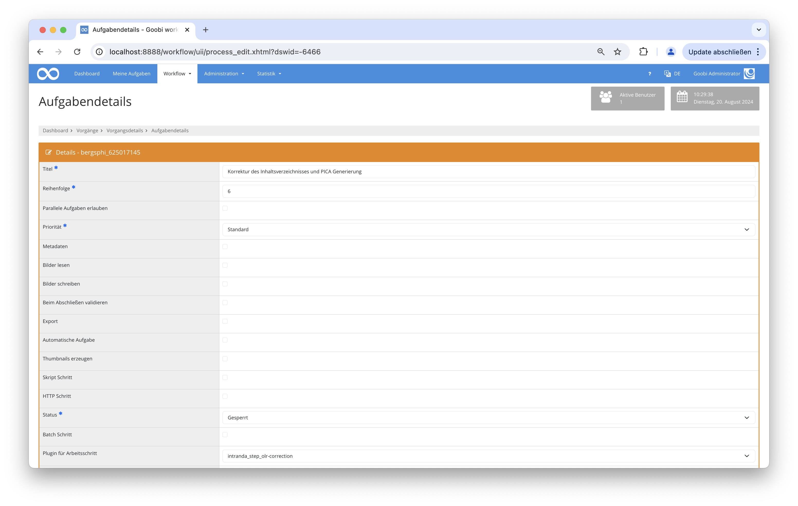

## Einführung
Diese Dokumentation beschreibt die Installation, Konfiguration und Verwendung des Plugins.

## Installation
Das Programm besteht aus diesen Dateien:

``` bash
plugin_intranda_step_olr-correction.jar
plugin_intranda_step_olr-correction.xml
```

Die Datei `plugin_intranda_step_olr-correction.jar` enthält die Programmlogik und sollte in diesen Pfad kopiert werden: `/opt/digiverso/goobi/plugins/step`.

Die Datei `plugin_intranda_step_olr-correction.xml` ist die Konfigurationsdatei und sollte in den Ordner `/opt/digiverso/goobi/config/` kopiert werden

Nach der Installation des Plugins kann dieses in einem Arbeitsschritt ausgewählt werden.



## Konfiguration
Die Konfiguration des Plugins erfolgt in der Datei `plugin_intranda_step_olr-correction.xml` wie hier aufgezeigt:

{{CONFIG_CONTENT}}

{{CONFIG_DESCRIPTION_PROJECT_STEP}}

Parameter               | Erläuterung
------------------------|------------------------------------
`bornDigital`| Wenn dies zutrifft, wird davon ausgegangen, dass die Dateien digital erstellt wurden und es sich nicht um gescannte Seiten handelt. |
