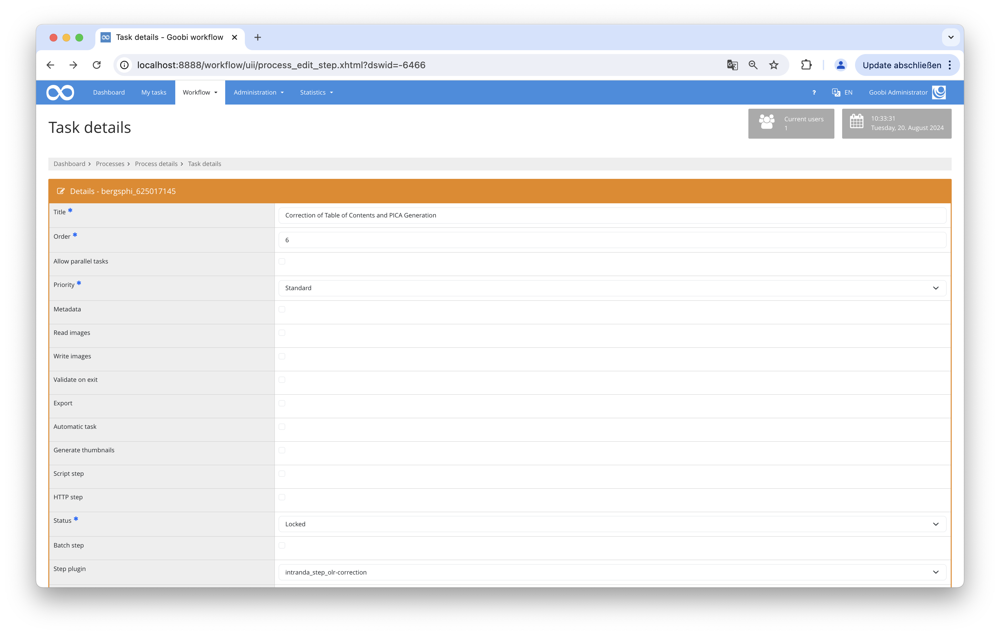

## Introduction
This documentation describes the installation, configuration and use of the plugin.

## Installation

The program consists of these files:

``` bash
plugin_intranda_step_olr-correction.jar
plugin_intranda_step_olr-correction.xml
```

The file `plugin_intranda_step_olr-correction.jar` contains the program logic, and should be copied to this path: `/opt/digiverso/goobi/plugins/step`.

The file `plugin_intranda_step_olr-correction.xml` is the config file, and should be copied to the folder `/opt/digiverso/goobi/config/`.

fter the installation of the plugin, it can be selected in a work step.



## Configuration
The configuration is done via the configuration file `plugin_intranda_step_olr-correction.xml` and can be adapted during operation. It is structured as follows:

{{CONFIG_CONTENT}}

{{CONFIG_DESCRIPTION_PROJECT_STEP}}

Parameter               | Erläuterung
------------------------|------------------------------------
 `bornDigital`          | If this is true, the files are assumed to be born digital and not scanned files.|
